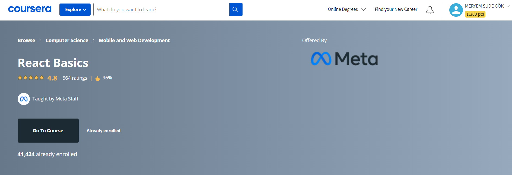
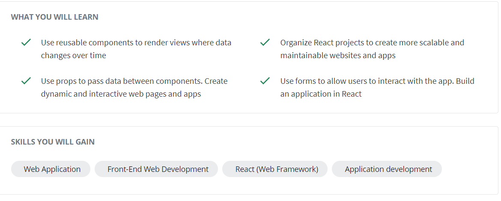
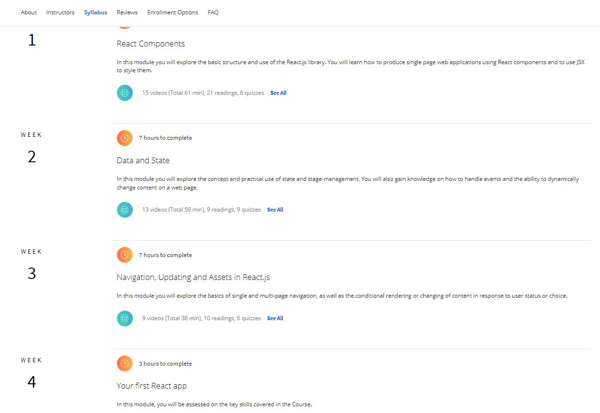

# Hi :upside_down_face:
In this repository, I will share the exercises I did while learning React (I'm taking the React Basics course from Meta (coursera)).

> I will also share some of my notes. :clipboard: 

   

